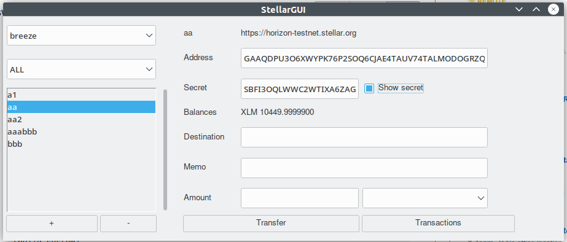

# stellargui

lightweight [stellar](https://www.stellar.org/) client

- Can manage multiple wallets across different networks

  

- Can see transactions

  

- Can see transaction detail

  

- Can Generate/Import wwallets

  

- Themeable

## installation
todo

## development

- `git clone https://github.com/xmonader/stellargui`
- `poetry shell`
- `poetry install`

## enable ttkthemes
Can be enabled using `poetry install -E ttkthemes` as it's defined as optional dependency 
## running 

`python3 stellargui/stellargui.py`

## TODO
- allow configuring multiple networks
- option to migrate money to another account